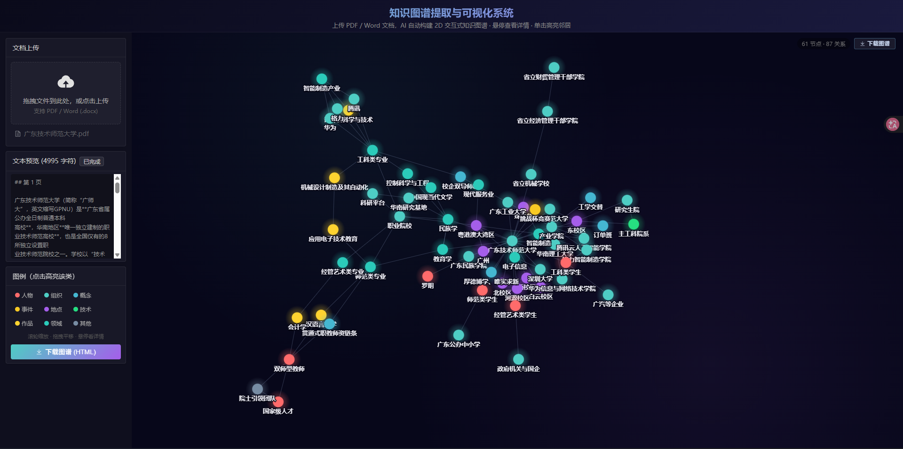

<div align="center">

# 🧠 本地知识图谱提取与可视化系统

**上传 PDF / Word，本地大模型自动提取实体与关系，渲染成可交互的 2D 力导向网状图。**

全链路本地运行 · 零云端依赖 · 隐私安全

     



</div>

---

## 📖 项目简介

随着电子文档激增，人工梳理长文档里的实体与关系既耗时又易遗漏。本系统用一个**完全跑在本地的大模型**，自动从 PDF / Word 中提取实体（人物、组织、概念、事件…）以及它们之间的多元关系，并以**二维力导向网状图**可视化——让你一眼看清文档的脉络。

所有数据不出本机，断网可用，适合处理论文、教材、报告、传记等敏感或大体量文档。

---

## ✨ 核心特性

|     | 特性                  | 说明                                                             |
| --- | --------------------- | ---------------------------------------------------------------- |
| 🔒  | **完全本地**          | 前端 + 后端 + 推理三层都在本机，不调任何云端 API                 |
| 🧠  | **推理型大模型**      | Gemma4-12B-QAT Balanced，"先推理再作答"，关系挖掘深入            |
| 🕸️  | **反星型 + 强制连通** | Prompt 约束 + 后端最大连通分量兜底，杜绝"一中心一圈叶子"和离群点 |
| 🎨  | **丰富交互**          | 悬停看详情卡片、单击高亮邻居与关联边、图例聚光灯、弹性拖拽       |
| 💾  | **刷新不丢**          | 文档与图谱存 localStorage，刷新页面无需重传重提                  |
| 📤  | **离线导出**          | 一键导出完全自包含的 HTML，断网双击即可交互查看                  |
| ⚡  | **MTP 加速**          | 投机解码提速约 60%，分块多次调用收益叠加                         |

---

## 🏗️ 整体架构

```
┌──────────────┐     ┌──────────────────┐     ┌──────────────────┐
│  前端 (Vue)   │ ──► │ 后端 (FastAPI)    │ ──► │ 推理 (llama.cpp) │
│  :5173       │ /api│  :3000            │HTTP │   :8000 GGUF模型 │
│  2D可视化     │ ◄── │  解析+分块+转发    │ ◄── │ OpenAI兼容接口   │
└──────────────┘     └──────────────────┘     └──────────────────┘
```

| 层       | 技术栈                                                          | 端口 | 职责                                                             |
| -------- | --------------------------------------------------------------- | ---- | ---------------------------------------------------------------- |
| **前端** | Vue 3 + Vite + Element Plus + force-graph (Canvas2D + d3-force) | 5173 | 上传 UI、文本预览、2D 网状图、加载动画、交互、离线导出           |
| **后端** | FastAPI + pdfplumber + python-docx + httpx                      | 3000 | 文档解析、CORS 白名单、分块提取、合并去重、连通性兜底、JSON 容错 |
| **推理** | llama.cpp 的 `llama-server`                                     | 8000 | 加载本地 GGUF 模型 + MTP 投机解码，提供 OpenAI 兼容接口          |

---

## 🚀 快速开始

### 环境要求

- **OS**：Linux / WSL2 / Windows 原生（Windows 用附带的 `start.bat`，见下文「🪟 Windows 原生运行」）
- **Python**：3.10+（推荐用 conda）
- **Node.js**：18+
- **GPU**：消费级 GPU 即可（8–12GB 显存，模型仅 6.9GB）
- **llama.cpp**：已编译 `llama-server`

### ① 下载模型

```bash
python down.py   # 通过 HuggingFace 代理拉取 GGUF 到 model/
```

### ② 安装依赖

```bash
# 后端（conda 环境 AI）
pip install -r requirements.txt

# 前端
cd frontend && npm install
```

### ③ 一键启动 🎉

```bash
./start.sh          # 启动全部服务（默认）
./start.sh stop     # 停止全部（含兜底 pkill 清理）
./start.sh restart  # 重启
./start.sh status   # 查看运行状态
```

启动顺序：`llama-server(8000) → 后端(3000) → 前端(5173)`。日志在 `logs/`，PID 在 `.run/`。

浏览器打开 **http://127.0.0.1:5173** 即可使用 🎉

### 🪟 Windows 原生运行（可选）

不想装 WSL，也能在 Windows 原生跑起来，项目附带了 `start.bat`（用 `start` / `taskkill` / `netstat`，完全不依赖 bash）。

**前置条件**：

- **Windows 版 `llama-server.exe`**：从 [llama.cpp releases](https://github.com/ggerganov/llama.cpp/releases) 下载预编译包，或自行用 CMake + CUDA 编译。
- **Python 3.10+**（Windows 安装包，或 conda）和 **Node.js 18+**。
- 模型文件放到 `model/gemma-4-12b-uncensored/`（与 Linux 一致，可用 `python down.py` 下载）。

**第 1 步：配置路径**。打开 `start.bat`，修改顶部「Config」区的两项：

```bat
set "LLAMA_SERVER=D:\llama.cpp\build\bin\llama-server.exe"   REM 你的 llama-server.exe 路径
set "PYTHON=python"                                          REM 或 conda 环境 python.exe 的完整路径
```

**第 2 步：安装依赖**（首次）：

```bat
pip install -r requirements.txt
cd frontend && npm install && cd ..
```

**第 3 步：一键启动**：

```bat
start.bat          :: 启动全部（各服务开一个最小化窗口）
start.bat status   :: 查看 8000/3000/5173 端口占用
start.bat stop     :: 停止全部（含 taskkill 兜底）
```

启动后访问 **http://127.0.0.1:5173**。

> **与 Linux 版的设计差异**：Windows 版用 `start` 弹最小化窗口运行各服务、`taskkill` 按窗口标题+进程名停止、`netstat` 检测端口；不使用 bash、pkill、`&` 后台等 Linux 机制。脚本顶部带路径校验（找不到 `llama-server.exe` 或模型文件会提示并暂停）。

---

## 📖 使用指南

1. **上传文档**：拖拽 PDF / Word 到上传区，后端解析并回显文本预览。
2. **提取图谱**：点「提取知识图谱」，观看加载动画（节点网络脉冲 + 进度条 + 阶段提示），本地大模型分块提取。
3. **交互探索**：

    | 操作                 | 效果                                   |
    | -------------------- | -------------------------------------- |
    | 🖱️ **悬停节点**      | 左下角浮出详情卡片（移开自动消失）     |
    | 👆 **单击节点**      | 高亮该节点 + 邻居 + 关联边（再点取消） |
    | 🎨 **点击图例**      | 按类别聚光灯过滤（自动取消节点高亮）   |
    | ✊ **长按拖动节点**  | 相连节点像弹簧弹性跟随，松手回弹       |
    | 🖲️ **拖背景 / 滚轮** | 平移 / 缩放                            |
    | 💾 **刷新**          | 文档与图谱保留，无需重传               |

4. **导出分享**：点「下载图谱 (HTML)」→ 生成自包含离线文件，双击即可在任意浏览器交互查看。

**实体类别**：人物、组织、概念、事件、地点、技术、作品、领域、其他（9 类，各自配色）。

---

## 🧠 模型选型

选用 **`Gemma4-12B-QAT-Uncensored-HauhauCS-Balanced`**（Q4_K_M）+ **`mtp-gemma-4-12B-it`** 投机解码草稿头：

| 优势              | 说明                                                        |
| ----------------- | ----------------------------------------------------------- |
| **QAT 4-bit**     | 量化感知训练，6.9GB 装下 12B，质量近全精度，消费级 GPU 可跑 |
| **Balanced 推理** | "先推理再作答"，对实体识别与关系挖掘尤其有利                |
| **MTP 投机解码**  | 草稿头多 token 预测 + 主模型验证，提速 ~60% 且输出不变      |
| **256K 上下文**   | 原生超长上下文，长文档处理无压力                            |
| **Uncensored**    | 0/465 拒绝率，不因安全过滤丢失实体                          |
| **作者调校采样**  | 专门为该 build 调校（见下表）                               |

**采样参数（作者推荐，实测是防 reasoning 死循环的正解）：**

| 参数                        | 值              | 作用                                            |
| --------------------------- | --------------- | ----------------------------------------------- |
| `temperature`               | 0.6             | 关系挖掘的随机性与稳定性平衡                    |
| `top_k` / `top_p` / `min_p` | 64 / 0.9 / 0.05 | 作者推荐                                        |
| **`repeat_penalty`**        | **1.1**         | **防 reasoning 陷入 "Wait…Wait…" 死循环的关键** |
| `max_tokens`                | 12288           | 容纳思考链 + 完整 JSON（reasoning 共享预算）    |

---

## ⚙️ 配置

### 环境变量

| 变量                 | 默认                                          | 说明                                  |
| -------------------- | --------------------------------------------- | ------------------------------------- |
| `LLM_API_URL`        | `http://localhost:8000/v1/chat/completions`   | llama-server 地址                     |
| `LLM_MODEL`          | `gemma-4-12b-uncensored`                      | 模型名（与 `--alias` 一致）           |
| `KG_ALLOWED_ORIGINS` | `http://127.0.0.1:5173,http://localhost:5173` | CORS 白名单（逗号分隔，可追加局域网） |

### 分块参数（`main.py`）

```python
SINGLE_CALL_MAX = 3000   # ≤ 该值单次调用，不分块
CHUNK_SIZE      = 2000   # 每块字符数
CHUNK_OVERLAP   = 200    # 块间重叠
MAX_CHUNKS      = 6      # 最多块数（超长文档截断）
```

---

## 📁 项目结构

```
class_AI_deploy_and_apply/
├── main.py                 # FastAPI 后端：文档解析 + 分块提取 + 合并 + 连通性兜底
├── down.py                 # 下载 GGUF 模型
├── start.sh                # 一键启动/停止/重启/状态（Linux / WSL）
├── start.bat               # 一键启动/停止/状态（Windows 原生）
├── requirements.txt
├── frontend/
│   ├── package.json
│   ├── vite.config.js      # /api 代理到 127.0.0.1:3000
│   ├── public/
│   │   └── force-graph.min.js   # 导出离线 HTML 时内联
│   └── src/
│       └── App.vue         # 上传 UI + 2D 图谱 + 交互 + 导出
├── model/
│   └── gemma-4-12b-uncensored/   # 主模型 + MTP 草稿头
├── uploads/                # 解析后的 Markdown 缓存
└── logs/                   # llm / backend / frontend 日志
```

---

## 🔧 技术亮点与踩坑精华

### 后端

- **反星型 + 连通性 Prompt**：硬性结构约束 + 7 个关系挖掘维度 + few-shot 网状示例，从源头避免星型退化。
- **连通性后端兜底**：`_largest_component` 用 BFS 找最大连通分量，丢弃离群点与小子图，保证输出一定连通。
- **容错 JSON 提取**：reasoning 模型可能先吐思考链，`_parse_graph_json` 用括号匹配抓第一个平衡的 `{...}`，抗截断抗污染。
- **重试 + 采样**：单块失败提高 temperature 重试；`repeat_penalty 1.1` 防死循环。

### 前端 · force-graph 踩坑实录

| 坑                               | 解决                                                           |
| -------------------------------- | -------------------------------------------------------------- |
| `ForceGraph(el)` 不建 canvas     | kapsule 两阶段：`ForceGraph()(el)`                             |
| 切换图例画面不变                 | 力模拟冷却不重绘，调 `d3ReheatSimulation()`                    |
| Vue patch 与 canvas 冲突刷屏崩溃 | 浮层全部移出 `graph-container`，用 `graph-wrap` 隔离           |
| `onBackgroundClick` 吞掉节点单击 | 注册它会启用拖拽检测，单击被判 drag → 移除它                   |
| 单击节点邻居亮、边不亮           | force-graph 包装 link 端点，引用对不上 → 改 **id 字符串比较**  |
| 点击高亮节点越漂越远             | `onEngineStop` 后设 `fx/fy` 锁定，reheat 只重绘不移动          |
| 弹性拖拽 vs 防漂移冲突           | 三段式锁定：拖时释放非被拖节点、松手回弹、稳定后重锁           |
| 导出循环引用                     | force-graph 原地加 `neighbors/x/y`，导出前清洗                 |
| `?raw` import 被禁               | force-graph `exports` 封子路径 → 复制到 `public/` 运行时 fetch |

### 推理调参历程

输出截断问题层层递进，最终定位到 **reasoning 共享 max_tokens 预算**：

```
ctx 太小装不下        →  ctx 8192 → 16384
max_tokens < JSON     →  提升 max_tokens
思考链 "Wait…" 死循环 →  repeat_penalty 1.1
思考链吃掉输出预算     →  max_tokens → 12288
```

---

## ❓ FAQ

**Q：为什么提取时模型输出会被截断 / 报 JSON 解析失败？**
A：Gemma4 Balanced 是 reasoning 模型，思考链和最终 JSON 共享 `max_tokens` 预算。本项目已设 `max_tokens=12288` 并加了容错 JSON 提取（括号匹配）。

**Q：图谱里有离群点 / 多张分离的小图？**
A：Prompt 已加"连通性最高优先"约束，后端还有 `_largest_component` 兜底，丢弃非最大连通分量。看 `logs/backend.log` 的"连通性过滤"行。

**Q：刷新页面图谱没了？**
A：不会。文档和图谱存在浏览器 localStorage，刷新自动恢复（换浏览器/清缓存除外）。

**Q：如何让局域网其他设备访问？**
A：`start.sh` 里把 `--host` / uvicorn `--host` 改成 `0.0.0.0`，并用 `KG_ALLOWED_ORIGINS` 追加允许的 origin。

**Q：支持其他模型吗？**
A：支持任意 OpenAI 兼容的 llama-server 模型，改 `LLM_MODEL` 环境变量 + `--alias` 即可。

---

## 🔒 安全说明

- 各服务默认只监听 `127.0.0.1`，CORS 收紧为白名单，本地使用安全。
- 文档全程不出本机（后端解析 → 本地推理 → 本地渲染）。
- 如需局域网访问，务必同时放开监听地址并追加允许的 origin。

---

## 📄 License

MIT License — 详见 [LICENSE](LICENSE)。

模型权重遵循各自的许可：

- Gemma 4：Google DeepMind，[Gemma License](https://ai.google.dev/gemma/terms)
- Uncensored build：HauhauCS
- MTP 草稿头：Unsloth

---

<div align="center">

**⭐ 如果这个项目对你有帮助，欢迎 Star！**

Built with ❤️ using Vue 3 · FastAPI · llama.cpp · Gemma 4

</div>
